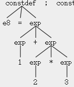
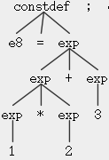
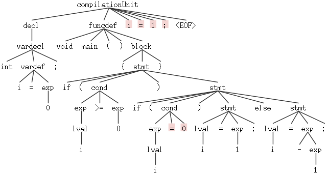

# c1 语言的语法分析

宋小牛 PB15000301

## 主要任务

* 根据 [C1语言](https://clarazhang.gitbooks.io/compiler-f2017/content/parser.html#c1-语言说明) 的 EBNF 描述修改并完善课程C1 的语法描述文件`c1recognizer/grammar/C1Parser.g4`，
* 请编写若干个正确的和错误的C1程序作为测试程序，利用 [ANTLR v4](https://clarazhang.gitbooks.io/compiler-f2017/content/parser.html#antlr-v4-的使用) 节介绍的`antlr4`和`grun`工具编译和测试所构造的C1 语法分析器。

## 重点难点

* 分析和总结 ANTLR 对左递归文法的处理方法

##语法描述文件

直接根据 EBNF 描述来补全`C1Parser.g4`中的各项。需要注意的是：

* EBNF描述中 CompUnit 的推导略麻烦且有左递归。根据语义在 g4 中直接写成

  ```
  compilation: (decl | funcdef)+
  ```

* compilation 需以 EOF 结尾，否则结尾不符合 compilation 的部分会被直接丢弃，且没有报错

  ```
  compilation: (decl | funcdef)+ EOF
  ```

* 初始的 exp 中没有 lval

  ```
  exp:
      exp (Multiply | Divide | Modulo) exp
      | exp (Plus | Minus) exp
      | (Plus | Minus) exp
      | LeftParen exp RightParen
      | lval
      | Number
  ;
  ```

## 测试

### 编译

需先编译`C1Lexer.g4`再编译`C1Parser.g4`

```shell
$ antlr4 C1Lexer.g4
$ antlr4 C1Parser.g4
$ javac *.java
```

### 运行

```shell
$ grun C1 compilationUnit -gui ../test/test_cases/declarations.c1
```

### 结果

* [`declarations`](declarations.png)

* [`expr`](expr.png)

  可见此处 * 先于 + 运算

  

  调换其中`e8`的 * 、+ 位置后结果仍为 * 运算优先

  

* 构造了一个错误样例`Parser_test.c1`

  ```c
  int i = 0;
  void main()
  {
      if(i >= 0) 
          if(i = 0) i = 1;
      else i = -1;
  }
  i = 1;
  ```

  结果:

  其中`cond`算符为`=`，不符合语法规则；`EOF`之前的语句非`decl`，故报错。这里如果将`C1Parser.g4`中`compilationUnit`的`EOF`删去，则最后一句`i = 1;`将被忽略且没有报错。
